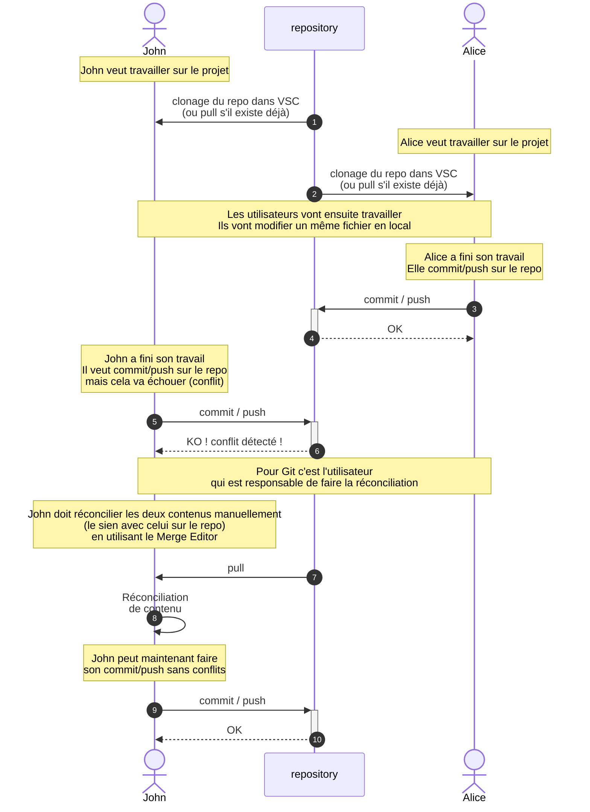

# Exercice 02 : Scénario de modification de lignes identiques

Veuillez prendre connaissance du contexte de l'exercice avant de passer à sa réalisation.

TIPS: veuillez noter que github, lors d'une mise en commun de modification de plusieurs utilisateur, effectue une comparaison ligne par ligne. Dans ce scénario, les lignes modifiées sont **identiques**. Découvrer comment github gère cette situation!

## Contexte de l'exercice

Ce schéma vous indique la situation générale correspondant à l'activité proposée.
Revenez-y lorsque vous rencontrerez une situation similaire ultérieurement.



## Déroulement de l'exercice

Avec le même groupe que l'exercice précédent, vous travaillez sur un repository distant commun à tous.

Trois éléments vous sont donnés:
  
- [Un schéma récapitulatif des étapes à effectuer](#description-schématique-de-lexercice)

- [Les lignes à modifier pour effectuer l'exercice](#lignes-à-modifier-selon-explications-du-scénario-ajouter-un-texte-de-votre-choix)

- [La description détaillée et solution en utilisant les menus du plugin github dans VSC](#description-détaillée-et-solution-de-lexercice)

## Description schématique de l'exercice

 ```mermaid

    flowchart TD

    A[Début de l'exercice] --> B[Tirer-pull les dernières modifications de ce repository]
    B --> C[Définissez la ligne commune à modifier]
    C --> D[Ajouter un texte court de votre choix]

    D --> E[Utilisateur Alpha : Commit & Push]
    E --> F[Modification synchronisée avec le dépôt distant]


    D --> G[Utilisateur Beta : Attente]
    G --> H[Utilisateur Beta : Commit & Push]

    H --> J[Utilisateur Beta : Git alerte qu'il ne peut pas effectuer le push]
    J --> K[Utilisateur Beta : Effectuer un pull]
    K --> L[Git détecte un conflit et l'indique en rouge]
    L --> M[Utilisateur Beta: résout et valide le conflit à l'aide du Merge Editor]
    M --> N[Utilisateur Beta : Push, pousser les modifications mergées]
    N --> O[Contrôler que les modifications Alpha et Beta soient présentes dans le dépôt distant]
    O --> P[Fin de l'exercice]


```

## Lignes à modifier selon explications du scénario (ajouter un texte de votre choix)

1.
2.
3.
4.
5.
6.
7.
8.
9.
10.

## Description détaillée et solution de l'exercice

Dans cette exercice, vous allez simplement modifier la même ligne de ce fichier, mais en prenant soin de vous mettre d'accord avec vos collègues afin de modifier une ligne identique.

Dans ce cas de figure, github ne sera pas capable de resynchroniser vos modifications automatiquement.

Voici les étapes à suivre:

### 1. Avant de commencer, assurez-vous d'avoir tirer (pull) les dernières modifications sur ce repository.

- Lorsque chacun à effectué un pull, répartissez-vous les lignes ci-dessus à compléter.

### 2. Ajouter un texte court de votre choix

### 3. Effectuer à tour de rôle des commit&Push

- Lorsque chacun à modifié ses lignes, effectuer à tour de rôle un commit&push et observer chez chacun se qui se passe:
  - Le premier (utilisateur Alpha) qui effectue le commit&push ne devrait rencontrer aucun message de conflit.
  - Le deuxième (utilisateur Beta) essaye d'effectuer un commit&push. Git va alors vous alerter que des modifications ont été effectuées
  
     

  - Vous pouvez consulter le message de git-error, qui explique exactement ce qui se passe:

     

  - Vous effectuez alors un pull (soit dans le terminal, soit avec le menu contextuel)
  
     

### 4. Détection et réslution manuel du conflit

- Git détecte alors un conflit et marque le Merge en rouge,
  
    

    anisi que le nom de votre fichier

    

- Vous devez résoudre vous-même le conflit à l'aide du Merge Editor:


- Vous modifiez manuellement le fichier résultant


- Vous validez vos modifications


- Vous effectuez un commmit&push

### 5. Contrôle du résultat final

- Vous contrôlez finalement que ces modifications sont bien présentes dans le repository distant
  

