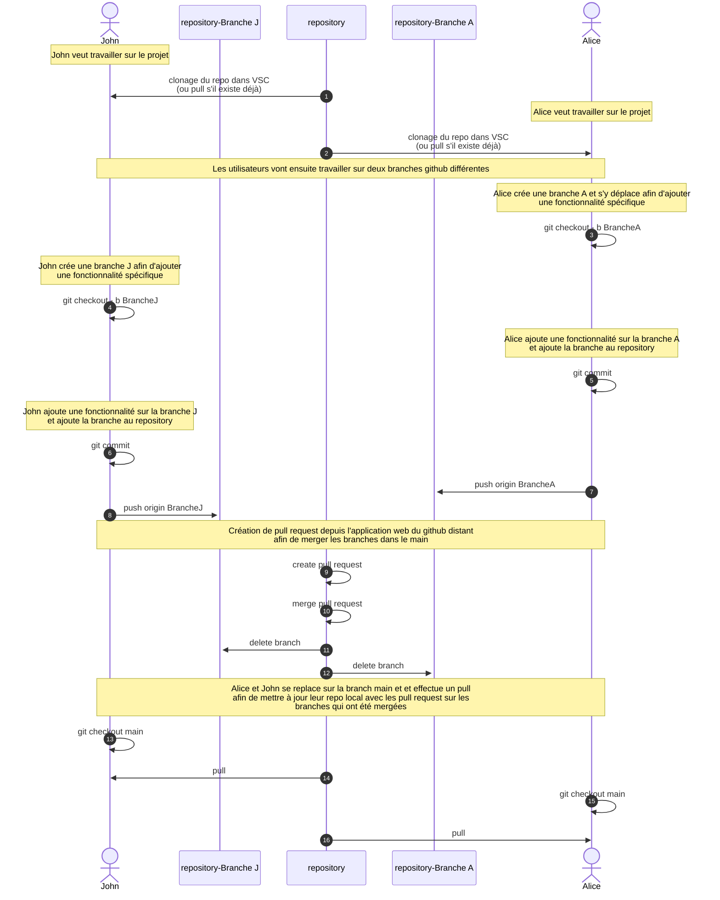

# Exercice 03: Gestion des branches

Veuillez prendre connaissance du contexte de l'exercice avant de passer à sa réalisation.

## Contexte de l'exercice

Ce schéma vous indique la situation générale correspondant à l'activité proposée.
Revenez-y lorsque vous rencontrerez une situation similaire ultérieurement.

## Déroulement de l'exercice

Cet exercice s'effectue à 2 ou 3 personnes. Par conséquent vous formez les groupes et ensuite vous clonez le même repository distant.
Pour cela l'enseignant (ou vous si vous avez les autorisations) ajoute les membres du groupe à ce seul repository.

Vous suivez le déroulement décrit dans contexte ci-dessus afin d'effectuer l'exercice.

Vous utiliser le fichier [ServiceAnimaux.java](/exercices/src/services/ServiceAnimaux.java) pour effectuer des modifications de code

- le développeur A rendra active la fonction ajouterAnimal dans une branche A
- le développeur B rendra active la fonction afficherAnimaux dans une branche B
  
Vous utiliserez ensuite les commmandes données dans le [README-VSC-Github.md](/README-VSC-Github.md#les-branches-sur-github), le github de VSC et les fonctionalités de la platforme WEB permettant de visualiser votre repository distant.

Finalement vous serez capable d'exectuer votre application java contenant les modifications effectuées dans les deux branches.

## Eléments de la solution

### Création de branches

### Visualisation des branches

- Par le source control graph

- Dans l'application web du repo distant sous Insights/Network

### Création des pull request

