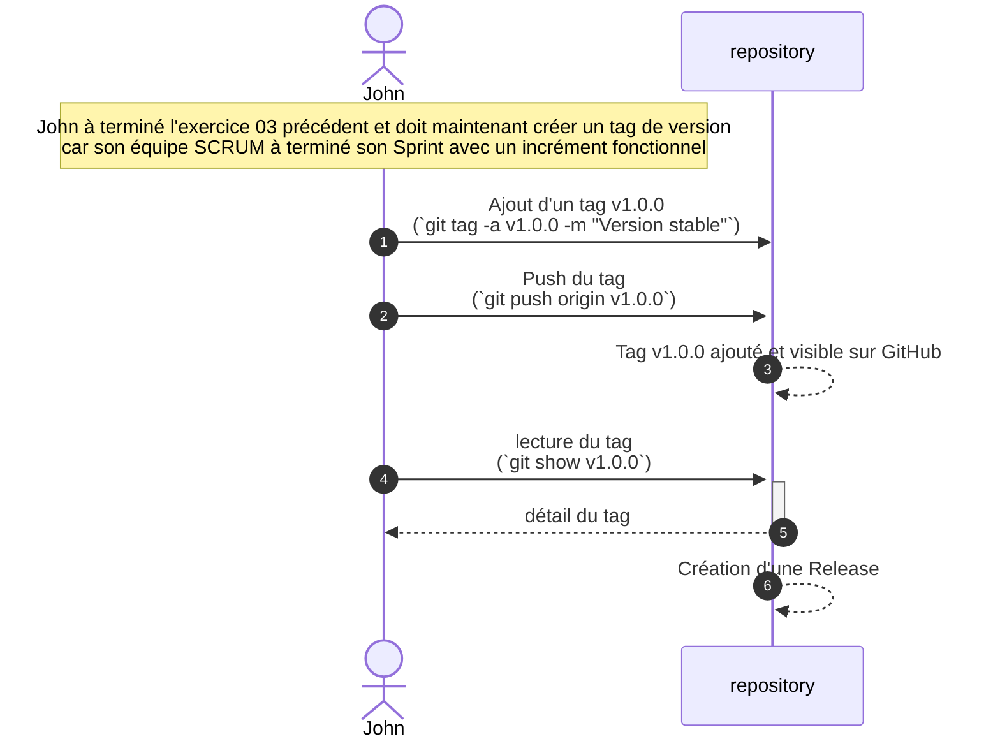

# Exercice 04: Gestion des versions

Un tag est un alias (un nom) défini par un développeur, dont le rôle est de pointer vers un commit. Il permet d’identifier facilement un commit.

**Les tags sont notamment utilisés pour marquer des numéros de version sur des commits.**

Veuillez prendre connaissance du contexte de l'exercice avant de passer à sa réalisation.

## Contexte de l'exercice

Ce schéma vous indique la situation générale correspondant à l'activité proposée.
Revenez-y lorsque vous rencontrerez une situation similaire ultérieurement.

## Déroulement de l'exercice

Cet exercice s'effectue à individuellement.

Vous suivez le déroulement décrit dans contexte ci-dessus afin d'effectuer l'exercice.

Vous utiliserez ensuite les commmandes données dans le fichier [README-VSC-Github.md](/README-VSC-Github.md#les-tags), le github de VSC et les fonctionalités de la platforme WEB permettant de visualiser votre repository distant.

## Eléments de solution

Après la création du tag

Après la création de la Release

